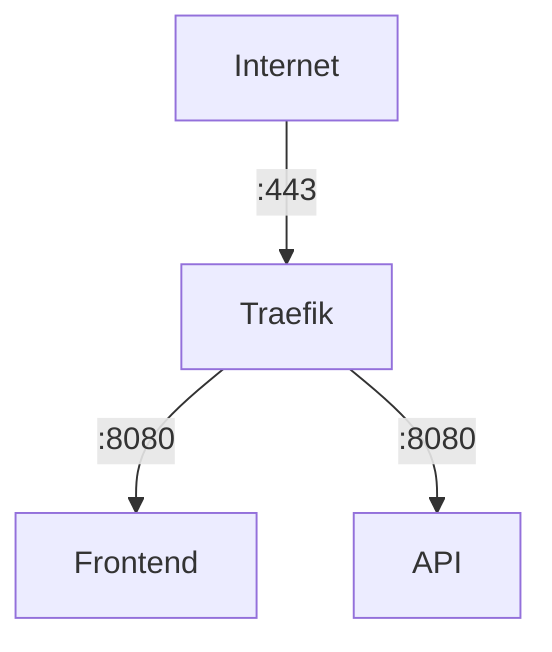

# how to use traefik as a Let´s-Encrypt Proxy

We setup a docker-compose that mimic the following behaivor

- User will connect to Traffic via `TLS:443``
- Traefik do all the plumping for TLS with LetsEncrypt
- Traefik forward the request via Rules to the appropiate docker-containers (`frontend` or `api`)

Before you can start - choose your flavor

## `subdomain.domain.com`

- you should use `http-challange`-Folder
- change the `subdomain.domain.com`-Placeholder
- change the `<EMAIL>`-Placeholder
- be aware that the

## `anything.subdomain.domain.com`

- you should use `dns-challange`-Folder
- change the `subdomain.domain.com`-Placeholder
- change the `<EMAIL>`-Placeholder
- create a token to use with Digitalocean Domain Service
- add the token to `<your-digitalocean-api-token>`-Placeholder in the `.env`-File
